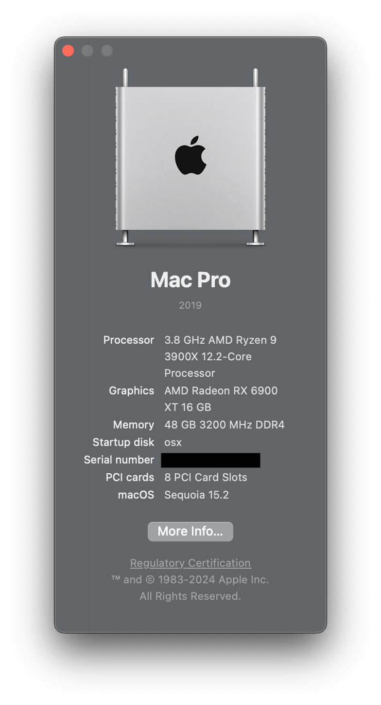
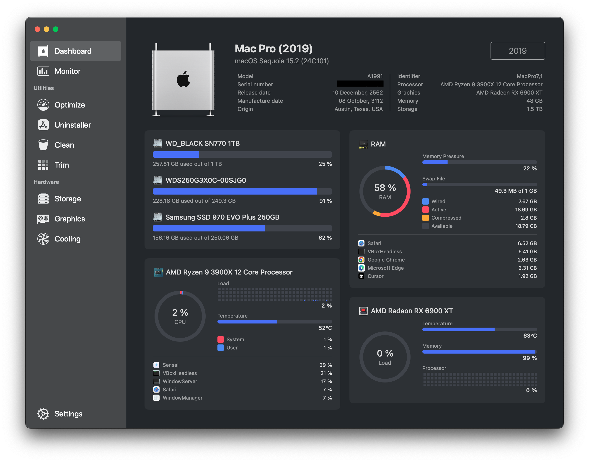
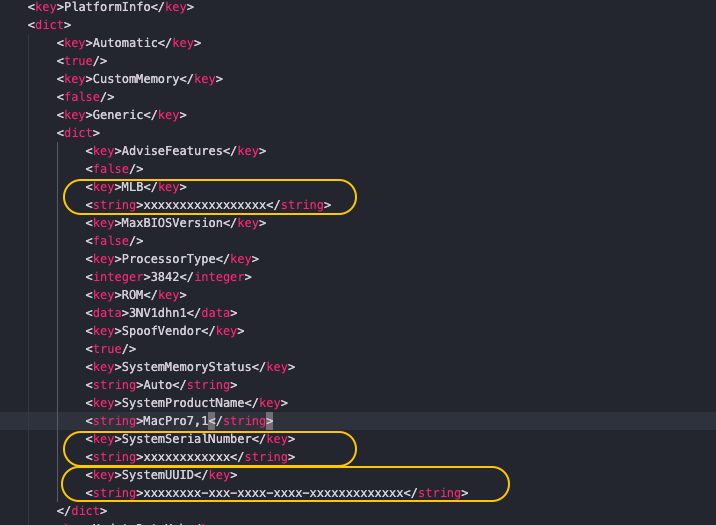

# OpenCore B550 / Ryzen 9 3900x

## EFI-B550-RX6900XT

## Create EFI From OpCore Simplify [link](https://github.com/lzhoang2801/OpCore-Simplify)

## Current Status
 - opencore 1.0.2
 - macOS sequoia 15.2

## :Spec: Hardware:

| **Category** | **Component**                                                                    |
| ------------ | -------------------------------------------------------------------------------- |
| **CPU**      | 4,5 GHz AMD Ryzen 9 3900x 12-Core Processor                                        |
| **GPU**      | GIGABYTE AORUS  - AMD Radeon RX 6900 XT 16GB                       |
| **RAM**      | 48GB  DDR4 3200MHZ  16x2 AND 8x2 (open XMP)                                                   |
| **CHIPSET**  | B550  aorus master [Gigabyte](https://www.gigabyte.com/th/Motherboard/B550-AORUS-MASTER-rev-10) |
| **M.2**      | 1TB                                                                   |

## Recomended  file Config.plist
- Config.plist -> PlatformInfo -> Generic

###### cr. surichai poprakon

<h2 align="left">Hi 👋!  My name is Surichai Poprakon and I'm an innovator, from Thailand </h2>

###